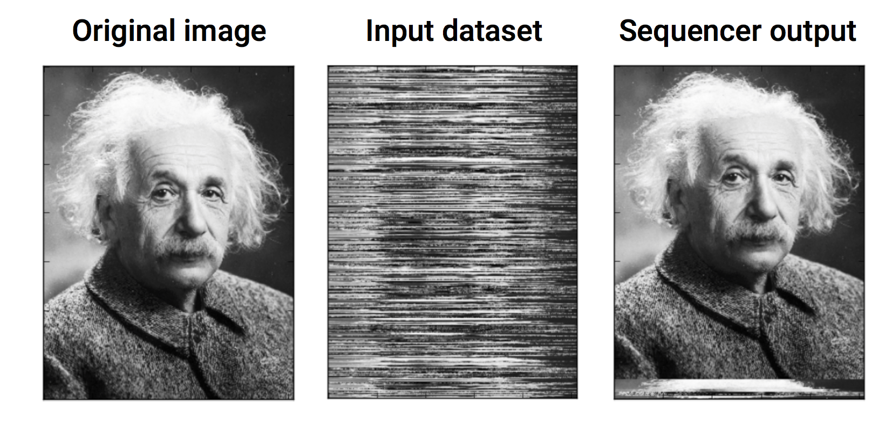
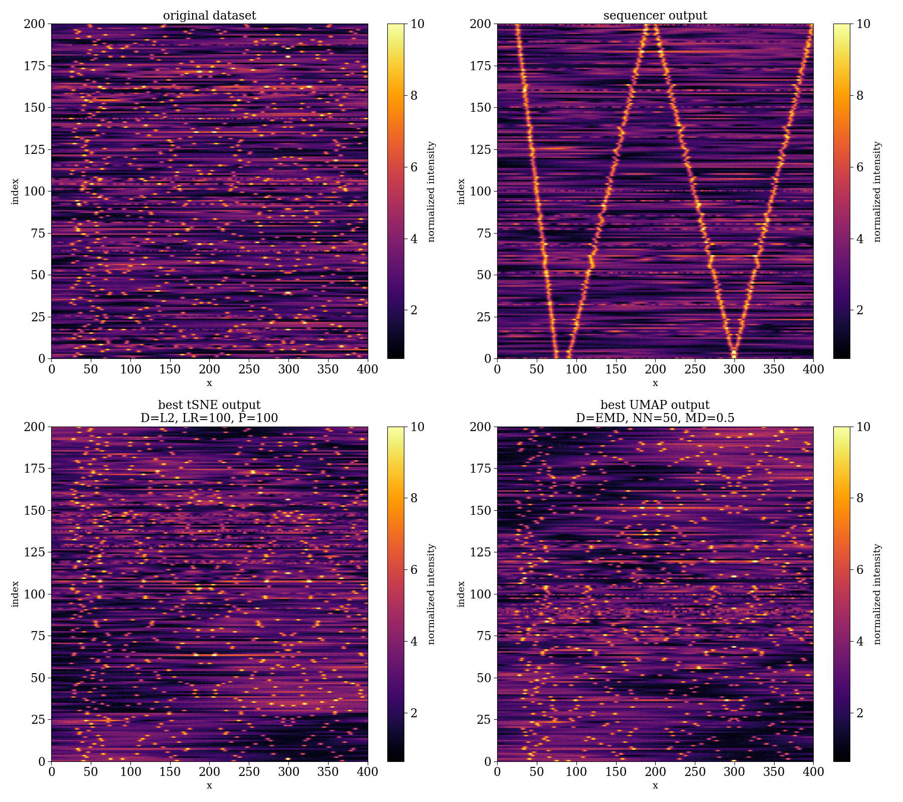

# The Sequencer
An algorithm that detects one-dimensional trends (=sequences) in complex datasets. 

## Overview
The Sequencer is an algorithm that attempts to reveal the main sequence in a dataset, if it exists.  To do so, it reorders objects within a set to produce the most elongated manifold describing their similarities which are measured in a multi-scale manner and using a collection of metrics. To be generic, it combines information from four different metrics: the Euclidean Distance, the Kullback-Leibler Divergence, the Monge-Wasserstein or Earth Mover Distance, and the Energy Distance. It considers different scales of the data by dividing each object in the input data into separate parts (chunks), and estimating pair-wise similarities between the chunks. It then aggregates the information in each of the chunks into a single estimator for each metric+scale.

The Sequencer uses the shape of the graphs describing the multi-scale similarities. In particular, it uses the fact that continuous trends (sequences) in a dataset lead to more elongated graphs. By defining the elongation of the graphs as a figure of merit, the Sequencer can optimize over its hyper-parameters (the distance metrics and scales) and select the set of metric+scale that are most sensitive to the presence of a sequence in the data. The elongation of the graph is measured using the graph's axis ratio. Thus, the final output of the Sequencer is the detected sequence and its associated axis ratio. Small axis ratio (~1) suggests no clear sequence in the data, and large axis ratio (~N, where N is the number of objects in the sample) suggests that the Sequencer detected a significant sequence in the data. 

The Sequencer is essentially an Unsupervised Dimensionality Reduction algorithm, since a sequence is a one-dimensional embedding of the input dataset. There are several differences between the Sequencer and other dimensionality reduction techniques like tSNE and UMAP. First, the Sequencer can only embed the input dataset into a single dimension, while algorithms like tSNE and UMAP can embed the data into higher dimensions as well (2D or 3D). The main advantage of the Sequencer is that it uses a figure of merit to optimize over its hyper-parameters, while other dimensionality reduction algorithms depend on a set of hyper-parameters and lack a clear figure of merit with which these can be optimized. As a result, the output of other dimensionality reduction algorithms depends on a set of chosen hyper-parameters, which are often set manually. In our work, we show that in some cases the Sequencer outperforms tSNE and UMAP in finding one-dimensional trends in the data, especially in scientific datasets. We also show that the elongation of a graph can be used to define a figure of merit for algorithms like tSNE and UMAP as well. This figure of merit can be used to select the hyper-parameters that will give rise to the "best" tSNE and UMAP embedding (see our paper and the jupyter notebooks in the examples directory).

## Online Interface
For those who are not very familiar with python: there is an online interface where one can upload their dataset and the Sequencer will be applied to it: http://sequencer.org/.

## Authors
* Dalya Baron (Tel Aviv University; dalyabaron@gmail.com)
* Brice Ménard (Johns Hopkins University)

## Requirements
The Sequencer is implemented in python and requires the following:
* python 3.7.1
* numpy 1.18.1
* scipy 1.3.1
* networkx 2.4

To run the Jupyter notebooks in the examples directory, and to compare the Sequencer to tSNE and UMAP, you will also need:
* matplotlib 3.1.2
* scikit-learn 0.22.1 (to run tSNE)
* umap 0.3.9 (to run UMAP; https://github.com/lmcinnes/umap)

## How to install the Sequencer 
XXX remains to be written

## How to use the Sequencer
The examples directory consists of several Jupyter notebooks showing how to use the Sequencer. New users are encoraged to start with the notebook `basic_sequencer_functionalities.ipynb`, which explains the basic functionalities of the Sequencer.

Below there is an example of a simple Sequencer run with default parameters:
```python
import sequencer

# define the Sequencer object
estimator_list = ['EMD', 'energy', 'KL', 'L2']
seq = sequencer.Sequencer(grid, objects_list, estimator_list)

# execute the Sequencer
output_directory_path = "sequencer_output_directory"
final_axis_ratio, final_sequence = seq.execute(output_directory_path)
```
The definition of the `Sequencer` object required a few input parameters: `grid`: the x-axis of the objects and `objects_list`: a list of the objects. This is the input dataset within which we want to find a sequence. The `estimator_list` is a list of strings containing the distance metrics to be considered during the algorithm run. It contains four distance metrics at the moment: `'EMD'`=Earth Mover Distance, `'energy'`=Energy Distance, `'KL'`=Kullback-Leibler Divergence, and `'L2'`=Euclidean Distance. The Sequnecer defines a list of scales it will consider automatically, where the number and values of the scales will be determined by the size of the data. However, users can set the scales by themselves. For example, if we wish to consider only the largest scales, and not to divide the objects into chunks, then:
```python
# define the Sequencer object
estimator_list = ['EMD', 'energy', 'KL', 'L2']
scale_list = [[1], [1], [1], [1]]
seq = sequencer.Sequencer(grid, objects_list, estimator_list, scale_list)
```
If instead we are intrested in small-scale information, where we want to split each object into 10 separate parts and examine them separately, then:
```python
# define the Sequencer object
estimator_list = ['EMD', 'energy', 'KL', 'L2']
scale_list = [[10], [10], [10], [10]]
seq = sequencer.Sequencer(grid, objects_list, estimator_list, scale_list)
```
Finally, if we do not know a-priori on which scale the relevant information is, we might want to examine several scales:
```python
# define the Sequencer object
estimator_list = ['EMD', 'energy', 'KL', 'L2']
scale_list = [[1, 2, 4, 8], [1, 2, 4, 8], [1, 2, 4, 8], [1, 2, 4, 8]]
seq = sequencer.Sequencer(grid, objects_list, estimator_list, scale_list)
```
This means that for each metric, the Sequencer will examine four different scales: 1, 2, 4, ans 8. A `scale=2` means that the Sequencer will split the objects into two parts and will search for a sequence in each of the parts separately. It will then aggregate the information from both of the parts into a single estimator. Finally, it will aggregate the information from all the combinations of metrics+scales into a single estimator, where metrics+scales that result in larger axis ratios will get a higher weight in the final product.

To execute the `Sequencer` obejct, we needed to define `output_directory_path`, which is a path of a directory to which different Sequencer products will be saved. The final output of the function consists of: (1) `final_axis_ratio`: the axis ratio of the resulting sequence. An axis ratio that is close to 1 suggests no clear sequence in the data. An axis ratio close to N, where N is the number of objects in the sample, suggests that the Sequencer detected a significant sequence in the data. (2) `final_sequence`: the resulting sequence. This is an array that contains the relative order of the different objects in the sample, such that they form the detected sequence.

## Examples directory
The [examples directory](https://github.com/dalya/Sequencer/tree/master/examples) contains several Jupyter notebooks that illustrate different aspects of the Sequencer algorithm. Users who are not familiar with the Sequencer are encouraged to go through the examples in the following order:
1. `basic_sequencer_functionalities.ipynb`: this notebook shows the basic functionalities of the algorithm. It shows how to apply the Sequencer to a simple simulated dataset with default settings. It shows how to extract various interesting properties of the algorithm, such as the intermediate axis ratios obtained during the calculation. It then shows some non-default settings that the user should be aware of (parallelization, varying scales, output options). 
2. `comparison_with_tsne_and_umap.ipynb`: this notebook compares the Sequencer output to the one-dimensional embedding by tSNE and UMAP for a simulated dataset. Importantly, this notebook presents a method to define a general figure of merit for Dimensionality Reduction algorithms that can be used to optimize their hyper-parameters. Using this figure of merit, we can optimize the hyper-parameters of tSNE and UMAP and compare their resulting sequence to the one obtained with the Sequencer.
3. `examples_with_natural_images.ipynb`: this notebook shows examples with scrambled natural images. In this notebook, the rows of different natural images are shuffled, and then the Sequencer is applied to the shuffled dataset with the goal of recovering the original image. Finally, the notebook shows the application of tSNE and UMAP to the shuffled images, while varying their hyper-parameters. It illustrates the importance of defining a figure of merit to optimize the hyper-parameters of dimensionality reduction algorithms (the user should go over the notebook `comparison_with_tsne_and_umap.ipynb` before going over this notebook).
4. `importance_of_multi_scale_approach.ipynb`: this notebook applies the Sequencer to stellar spectra, which are 1D objects with relevant information on many different scales (both small scales and large scales). The notebook shows how to extract the intermediate axis ratios of different chunks of data, and using these, illustrates the importance of the multi-scale approach of the Sequencer.
5. `beyond_1D_sequence.ipynb` (under construction): the Sequencer provides a one-dimensional embedding of the input dataset. This notebook shows how we can go beyond a 1D sequence using a method somewhat similar to PCA: once the main trend in the data is detected, we can 'strip' it from the data, and apply the Sequencer to detect the second strongest trend in the data, and so on. 
6. `two_dimensional_objects.ipynb` (under construction): so far, we applied the Sequencer to datasets consisting of 1D objects. This notebook shows how to apply the Sequencer to a dataset consisting of 2D objects (images).

## Selected results
### Shuffled image rows
The Sequencer reorders the objects in the input dataset according to a detected sequence, if such sequence exists in the dataset. A good example of a perfect one-dimensional sequence is a natural image: the rows within a natural image form a well-defined sequence. Therefore, we can shuffle the rows in a natural image, and apply the Sequencer to the shuffled dataset. The following figure shows the result of applying the Sequencer to a shuffled natural image. The left panel shows the original image. The middle panel shows the same image after we have shuffled its rows. The shuffled image serves as the input dataset to the Sequencer, where each row is considered as a separate object. The output of the Sequencer is shown in the right panel, where we reordered the rows according to the detected sequence. Apart from several rows that were misplaced, the Sequencer successfully identified the one-dimensional trend spanned by the different rows.



We examine several cases of scrambled natural images in the Jupyter notebook `examples_with_natural_images.ipynb` in the examples directory. For each of the images, we shuffle its rows and apply the Sequencer to the shuffled dataset with the goal of recovering the original image. We also compare the result of the Sequencer to the one-dimensional embedding by tSNE and UMAP.

### Simulated dataset with a sequence on small scales
The following figure shows an example of a simulated dataset with a clear one-dimensional sequence. The top left panel shows the input dataset, where each row is a separate object and the color-coding represents the relative intensity in each of its pixels. The objects are constructed to have both small-scale and large-scale fluctuations, and some added noise. In addition, we added several narrow pulses to each of the objects, such that their relative location forms a clear one-dimensional sequence. In the top right panel we show the output of the Sequencer, where we reordered the objects (rows) according to the detected sequence. Although the narrow pulses constitute a small fraction of the total integrated intensity in each object, the Sequencer correctly identified the one-dimensional trend. The success of the Sequencer in detecting this trend is a direct result of our multi-scale approach. The bottom panel shows the best one-dimensional embedding by tSNE and UMAP. One can see that the output of both of the algorithms is driven by the large-scale fluctuations. This result illustrates that tSNE and UMAP are not optimized to find the most elongated manifold in the dataset if it is not distributed over the full scale of the data.



We construct the simulated dataset and compare the Sequencer output to the one-dimensional embedding by tSNE and UMAP in the Jupyter notebook `comparison_with_tsne_and_umap.ipynb` in the examples directory. In addition, we show there how to define a general figure of merit for the one-dimensional embedding of any Dimensionality Reduction algorithm, using the graph axis ratio. We show how this figure of merit can be used to optimize the hyper-parameters of algorithms such as tSNE and UMAP, and thus select the "best" one-dimensional embedding.

## Citation 
XXX remains to be written
